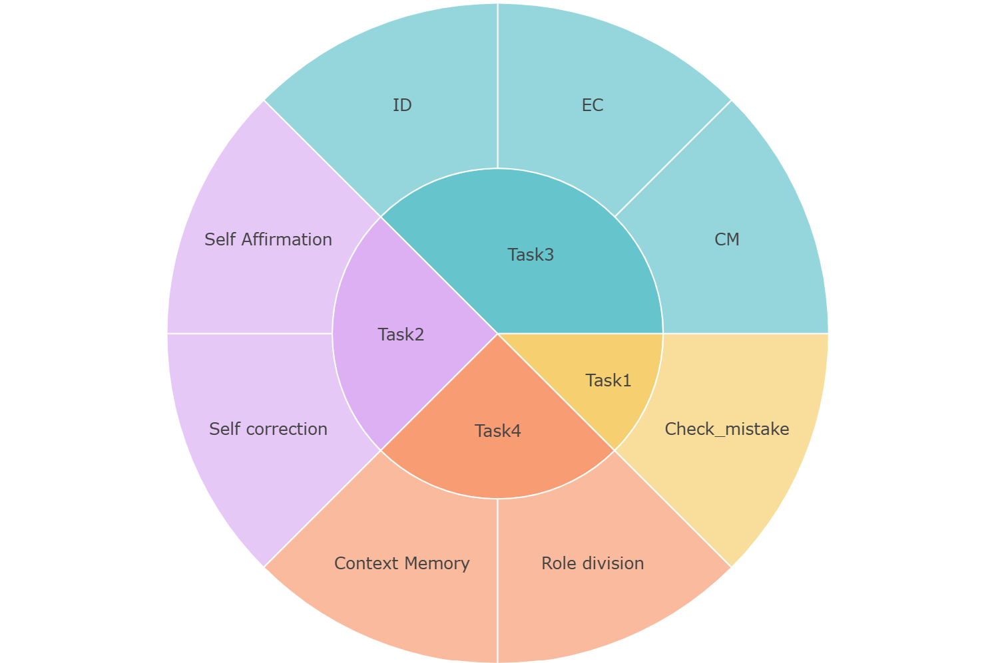
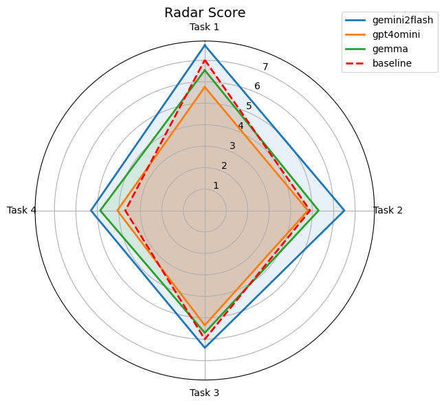

# MultiAgentClassroom - A Multi-Agent Framework for Interactive Learning & Discussion

**MultiAgentClassroom** is a Flask-based web application that creates a dynamic **virtual learning environment**. It enables real-time, structured discussions between **multiple AI agents** (acting as tutors, peers, or provocateurs) and human students. The framework is designed not just for collaborative problem-solving, but to facilitate **pedagogically-driven interactions**, including instruction, guided discovery, and reasoned debate. The core strength lies in its sophisticated **multi-agent system** that can be configured to simulate diverse classroom dynamics.

📹 [Demo video](https://drive.google.com/file/d/1lGEW4L2wPvkN2LoqJyVvhvQqEhAl8Mwo/view?usp=sharing)

---

## Core Multi-Agent Architecture for Educational Interactions

MultiAgentClassroom's architecture is designed to support rich educational experiences within its **multi-agent system**:

1.  **The Virtual Classroom Interface & Backend Support:**
    *   The **Frontend** (HTML/CSS/JS) serves as the student's interactive portal to the **multi-agent learning environment**, presenting discussions, agent contributions, and learning progress in real-time via Server-Sent Events (SSE).
    *   The **Flask Backend** functions as the central facilitator, managing learning sessions, routing student input to the **multi-agent teaching team**, and broadcasting instructional or debated responses from the agents.

2.  **The Multi-Agent Pedagogical Interaction Cycle:**
    *   **Initiating Learning & Context Setting:** Student input (a question, a statement, a solution attempt) or a pre-programmed instructional cue initiates the cycle. The **Conversation State Manager** (integrating the Phase Manager & History) establishes the current educational context (e.g., current learning objective, phase of discussion, prior student understanding) for all participating AI agents.
    *   **Concurrent Agent Pedagogical Reasoning:** This is where the **multi-agent system** models diverse teaching and learning roles. All configured AI agents, each operating under its YAML-defined **persona** (e.g., "Socratic Questioner," "Subject Matter Expert," "Supportive Peer," "Critical Thinker") and **instructional tasks**, independently use an LLM service. They formulate pedagogical responses, assess the student's input, and determine an initial intent to "speak" (to instruct, question, clarify, or challenge) or "listen" (to allow student reflection or peer interaction). This concurrent operation allows for adaptive and timely interventions.
    *   **Coordinated Instructional Speaker Selection:** This vital **multi-agent coordination** phase ensures the most effective pedagogical intervention. The **Speaker Selector** (an LLM-assisted component) systematically evaluates the "speak" intentions proposed by active agents. It scores these proposals based on their alignment with the current learning objective, the student's needs, the agent's designated pedagogical role, and the overall instructional strategy. The agent with the most pedagogically sound and contextually relevant proposal is selected to interact with the student.
    *   **Delivering the Instructional/Debate Response:** The selected agent, guided by the `BehaviorExecutor` and LLM, constructs its message. This message is carefully aligned with its pedagogical persona and the specific instructional goal that led to its selection by the **multi-agent system**.
    *   **Sharing Knowledge and Perspectives:** The chosen agent's response is distributed via the **Interaction Coordinator** and SSE to the student and all other agents. This ensures that the student receives targeted input while the entire **multi-agent teaching team** remains aware of the evolving learning dialogue.
  


3.  **Configuring the Educational Environment & Tracking Progress:**
    *   **YAML Files (Defining Pedagogical Roles & Learning Flows):** These files are instrumental in shaping the **virtual classroom**.
        *   `personas.yaml`: Define diverse AI agent roles (tutors, peers with different strengths, debate opponents) to create specific learning dynamics.
        *   `phases.yaml`: Structure learning activities or debate stages, guiding the **multi-agent** and student interaction through a defined pedagogical sequence.
        *   `problem_context.yaml`: Provides the subject matter, case study, or debate topic for the learning session.
    *   **SQLite Database:** Serves as a record of student-agent interactions, learning pathways, and discussion history, potentially for later review or assessment.
    *   **Environment Variables:** Securely manage API credentials.

This cyclical process allows the **multi-agent system** to facilitate a structured, interactive, and adaptive learning experience, where AI agents contribute according to their defined pedagogical roles to guide and challenge the student.

---

## Guide to Designing Your Multi-Agent Learning Environment via YAML

MultiAgentClassroom's YAML configuration empowers educators and designers to create tailored **virtual classroom** experiences:

1.  **`config/personas.yaml` (Crafting Your AI Teaching Team & Student Peers):**
    *   Define your **multiple AI agents** to fulfill specific educational roles:
        *   `name`: Agent identifier.
        *   `role`: Pedagogical function (e.g., "Math Tutor," "History Debater," "Socratic Guide," "Peer Collaborator").
        *   `goal`: The primary educational objective for this agent (e.g., "To foster critical thinking," "To explain core concepts clearly," "To encourage student participation").
        *   `backstory`: Defines its communication style (e.g., "inquisitive, patient," "analytical, direct") and personality.
        *   `tasks`: Specific instructional strategies or types of interactions this agent will employ (e.g., "Ask probing questions," "Provide worked examples," "Offer counter-arguments," "Summarize student points").

    *Example Snippet for a Pedagogical Multi-Agent Setup:*
    ```yaml
    SocraticTutor:
      role: "Guides students through questioning to discover answers themselves."
      goal: "To enhance critical thinking and self-discovery."
      backstory:
        style: "Inquisitive, patient, avoids giving direct answers."
      tasks: |
        - Ask probing questions related to the student's statement.
        - Prompt student to elaborate on their reasoning.
        - Highlight inconsistencies or assumptions in student's logic.
    ConceptExplainerAgent:
      role: "Clearly explains complex concepts related to the subject."
      goal: "To ensure foundational understanding of key topics."
      # ... other persona details
    ```

2.  **`config/phases.yaml` (Structuring Learning Activities & Discussions):**
    *   Outline the stages of a learning module, debate, or problem-solving session. Each phase guides the **multi-agent teaching team** and the student:
        *   `stage`: Phase ID.
        *   `name`: Title of the learning stage (e.g., "Introduction to Topic," "Deep Dive Analysis," "Argument Formulation," "Rebuttal Round").
        *   `description`: What the student and **AI agents** aim to accomplish.
        *   `tasks`: Specific learning activities or discussion points.
        *   `goals`: Learning outcomes or objectives for the phase.

3.  **`config/problem_context.yaml` (Defining the Learning Material):**
    *   Provides the subject matter content, case study, debate prompt, or problem that the **multi-agent system** and student will engage with.

**Key Educational Advantage:** By modifying these YAML files, educators can design diverse **multi-agent learning scenarios**—from one-on-one AI tutoring to complex group debates with AI peers—tailoring the experience to specific learning objectives and pedagogical approaches without altering the core application.

---
## Evaluation
### Baseline
We install [SimClass](https://arxiv.org/abs/2406.19226) as the baseline

### Methods
Drawing inspiration from MT-Bench-101, which focuses on conversation evaluation, this study proposes the generation of simulated conversations tailored to specific objectives or scenarios to assess the
capabilities of conversational agents. The conversation will be created first as a context, then a few agent turns will be created for evaluation. For a conversation between students solving a math problem, we chose four types of tasks to create an assessment scenario:



#### Results
The results show that the system outperforms the baseline on all four tasks.



---
## Flow of System


---
## Installation & Running Your Multi-Agent Learning Environment

1.  **Clone Repository**

    ```bash
    git clone https://github.com/khaidv123/VirtualClassroom.git
    ```

2.  **Set Up Virtual Environment**

    ```bash
    python -m venv venv
    ```
    Activate:
    *   macOS/Linux: `source venv/bin/activate`
    *   Windows: `.\venv\Scripts\activate`

3.  **Install Dependencies**

    ```bash
    pip install -r requirements.txt
    ```

4.  **Configure Environment Variables**
    *   Copy `.env.example` to `.env`: `cp .env.example .env`
    *   Edit `.env` with your credentials:
        ```dotenv
        GOOGLE_API_KEY="YOUR_GOOGLE_API_KEY"
        FLASK_SECRET_KEY="your-very-secret-flask-key"
        ```

5.  **Initialize the Database**
    (First time setup or schema changes)
    ```bash
    flask init-db
    ```

6.  **Run the Application**

    ```bash
    flask run
    ```
    Access via your browser at `http://127.0.0.1:5000`.

---
